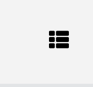
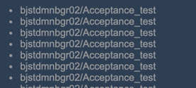

# Comments

1. \- 有图片放在了img文件夹外
2. \+ 有gitignore文件
3. \- gitignore里可以添加其他的补充项
4. \+ 界面大部分都按照示例画出来了
5. \- 大部分图片路径引用错误，导致图片无法显示，建议学习绝对路径和相对路径
6. \- 没有给图片正确的大小值
7. \- 有部分字体和颜色于示例不同，例如：

8. \- 缺少hover状态

9. \- 拖动屏幕到最下方的时候，最后一行的数据显示不全
10. \- hover的时候与design不同，background应该占据整行

11. \+ 做了头像hover后的弹框
12. \- css里id是唯一的，是不应该重复使用的
13. \- html提供了很多语意化的标签，例如可以考虑直接使用header标签去替代div
14. \- 建议不要使用br去调整字体位置，可以使用布局去进行位置调整
15. \- 有些classname起的不够表意
16. \- 有一些自适应的问题，例如当页面的width缩小时，图片会逃离上方的bar
17. \- 这里也可以使用grid